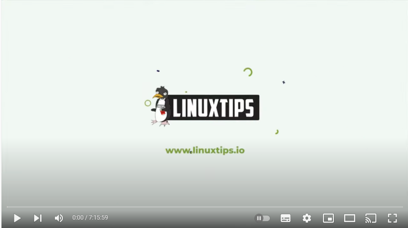
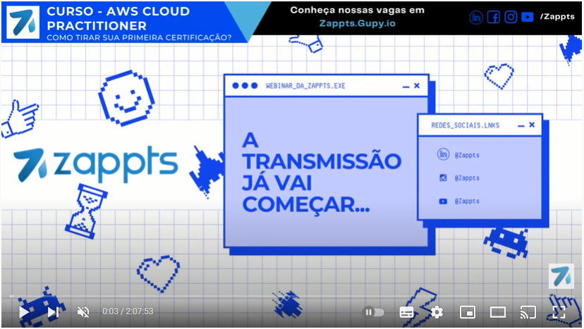

# Estudos para certificação AWS Cloud Practitioner   

Essa é uma certificação inicial da AWS e uma oportunidade para entender a computação em nuvem, suas vantagens técnicas e econômicas, que a diferencia do modelo de infraestrutura física.  

  

Fonte: <a target="blank" href = https://aws.amazon.com/pt/certification/certified-cloud-practitioner> AWS Treinamento e certificação </a>

***  

## Fonte do conteúdo   

### Bonde da AWS:   

O Bonde da AWS foi uma iniciativa entre a [LinuxTips](https://www.linuxtips.io/) e o pessoal da AWS em auxiliar na certificação Cloud Practitioner. Foram 7 horas de treinamento para a comunidade, focado nos principais domínios da prova.    

Ao final do curso há 30 perguntas baeadas no exame que também são boas para a preparação.

   

### AWS Cloud Practitioner - parte 1/3 (ft. Thauany Moedano)  

O curso da certificação ofertado pela Thauany Moedano, pela empresa Zappts, faz um overview focado em todos os temas da certificação. O conteúdo  é revisado levando em consideração a palavra chave de cada serviço da AWS que devemos nos atentar e seu caso de uso. O temas são bem divididos e de acordo com o guia da certificação. 

Sempre no final dos módulos, há algumas perguntas sobre os temas também para nos preparmos.

    

### AWS Skill Builder  (AWS Cloud Practitioner Essentials Portuguese)
 

A Skill Builder é a plataforma da AWS de treinamentos, inclusive para certificações. Neste sentido, o Curso voltado para a AWS Cloud Practitioner, é todo ministrado em português.  

O conteúdo é dividido de acordo com o que é cobrado na prova e passado de maneira interativa com ótima didática. É fundamental fazê-lo quando se parti do zero, como meu caso. Ao final de cada tópico possui um resumo, os links para as documentações e um quiz para nos testar.  

Ao final do treinamento, temos acesso a 30 questões que no ambientaliza aos temas que serão cobrados. 

Para fazer este curso, basta acessar a Skill Builder em: https://explore.skillbuilder.aws/learn/signin . Uma feito o cadastro, devemos pesquisa por: __AWS Cloud Practitioner Essentials Portuguese__ , conforme a seta indica no print abaixo.  

     

__OBS:__   

Ao final da preparação para os estudos ou durante as revisões, indico por último a realização de simulados. Os que me ajudaram fora 3 simulados que comprei na Udemy:

